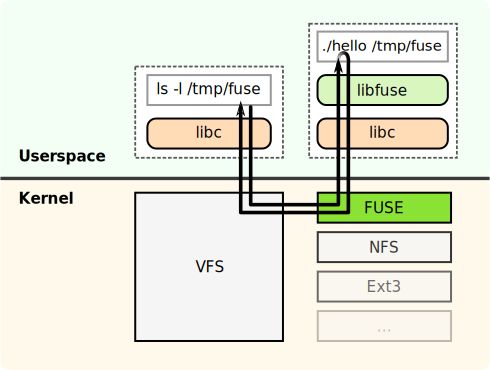

# Virtual Filesystem & Rust

---

## About me

| Associate Software Engineer | </img> |
| --- | --- |
| OpenShift Cloud Functions | </img> |

*  @slinkyguardiani</img>
*  @slinkydeveloper</img>
*  slinkydeveloper.com</img>

---

## Agenda

- ioctl, vfs e FUSE
- Data structure in stile Rust
- rust-fuse e un po' di glue code
- Da Java a Rust, qualche tip e considerazione personale

---

## Motivazioni

- L'estate fa caldo e al chiuso c'è l'aria condizionata <!-- .element: class="fragment" data-fragment-index="1" -->
- Provare Rust nel suo habitat naturale <!-- .element: class="fragment" data-fragment-index="2" -->
- Divertirmi con un po' di sys programming <!-- .element: class="fragment" data-fragment-index="3" -->

---

## Cos'è un filesystem?

> Un file system è l'insieme dei tipi di dati astratti necessari per la memorizzazione, l'organizzazione gerarchica, la manipolazione, la navigazione, l'accesso e la lettura dei dati

---

## E un virtual filesystem?

È il software che implementa le operazioni definite dal filesystem

---

## E il Virtual Filesystem Switch?

È il VFS che permette di accedere in modo trasparente a tutti gli altri FS montati nel nostro sistema

---

## Architettura

</img>

---

## Come implementiamo un Filesystem?

- <!-- .element: class="fragment" data-fragment-index="1" --> linux/fs.h
- <!-- .element: class="fragment" data-fragment-index="2" --> FUSE

Note: Perchè no driver:

- No fault isolation
- Più complesso il processo di sviluppo

---

## Filesystem in Userspace

</img>

---

## `json-fuse-fs`

</img>

Note:
Data structure composta da albero e due strutture di supporto ricavate dall'albero

---

## Json descriptor

```json
{
  "descriptor.txt": "raw:blabla",
  "nested": {
    "another_file.txt": "raw:a\nb\nc",
    "local.txt": "local:/home/francesco/projects/json-fuse-fs/README.md"
  }
}
```

---

## Data structure in stile Rust

---

## Primo tentativo

```rust
pub enum FSEntry {
    File {
        name: String,
        file_type: FSFileType,
    },
    Dir {
        name: String,
        entries: Vec<FSEntry>,
    },
}
pub enum FSFileType {
    Raw(RawFSFileType),
    Local(LocalFSFileType),
}
pub trait FSFileTypeOps {}
```

---

## Secondo tentativo

```rust
pub struct FSNode {
    pub inode: u64,
    pub name: String,
    pub parent: RefCell<Weak<FSNode>>,
    pub entry: FSEntry
}
pub enum FSEntry {
    File(FSFileType),
    Dir(Vec<Rc<FSNode>>)
}
```

Note:

* Inode è id nodo per fuse
* Spiega come funziona Rc
* Spiega Weak
* Spiega interior mutability pattern

---

## Da Java a Rust

## Guida all'uso

---

Cron per compilare ogni minuto

---

No _inheritance_, si _composition_ con le `enum`

---

Pattern matching/`if let` is the new `if`

Note: Mostra Option

---

Le macro sono un ottimo strumento per crearsi le proprie assertion

Note: Mostra macro per i test

---

I generics sono molto più potenti di quelli di Java

Note: Mostra implementazione flatten

---

## Rust non è difficile!

---

## Domande?

---

## Grazie a tutti!